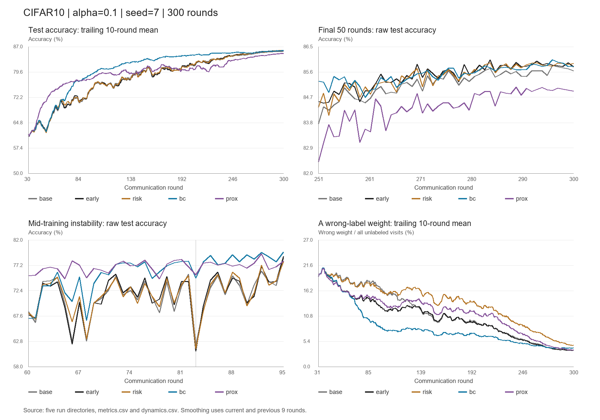

# risk、BC、prox 三个实验复盘

分析日期：2026-09-15。所有准确率均为百分数；差值为百分点。

## 结论

BC 显著改善中期准确率、收敛速度和逐轮稳定性，但末段没有提高 early 的最高点。risk 主要表现为放宽 A 组权重，没有实现预期的精准纠错。prox 能抑制早期客户端偏移，但当前强度和持续时间使后期落后。

“三个实验最高点都没有超过原版”并不完全准确：原版 trusted_lr015 的 best 为 85.83%，risk 为 85.92%，BC 为 86.03%；但 early 已达到 86.03%，因此本轮没有刷新已有最高纪录。

## 数据与比较口径

- 原版：`rev13_trusted_lr015_s7_20260912_232108_1369156_a0.1`
- early：`rev13_trusted_lr015_early_s7_20260913_231129_3175628_a0.1`
- risk：`rev13_trusted_lr015_risk_s7_20260914_181541_541317_a0.1`
- BC：`rev13_trusted_lr015_bc_s7_20260914_181549_541595_a0.1`
- prox：`rev13_trusted_lr015_prox_s7_20260914_181557_541825_a0.1`

来源均为仓库 `results/CIFAR10/runs/` 下上述目录。读取 config、metrics、dynamics、diag、geometry_audit、updates、client_updates、trust_reference、train.log；risk 额外读取 risk_audit、risk_calibration。分析未修改训练代码和原始结果。

五次运行的 metrics 都覆盖连续 1–300 轮，无缺轮或重复轮。种子为 7/0/7（模型/划分/抽样），20 个客户端、每轮 8 个、每客户端 5 个 epoch、初始 LR=0.15，配置记录每类有标签数据 500。客户端抽样序列逐条相同，共 2400 条，聚合权重均为 0.125。前 30 轮准确率完全相同。Phase2 均始于 91 轮，Phase3 均始于 136 轮。新三组直接基于 early，而非只在原版上添加单项，因此评价新增机制需要对照 early。

阶段均值是该区间逐轮测试准确率的算术平均。末段固定为 271–300 轮。逐轮波动是 |本轮准确率−上轮准确率| 的平均值，区间首轮使用其前一轮；大跌定义为下降超过 3 个百分点。训练伪标签精度使用 correct 总和 / visits 总和，不直接平均客户端百分比。所有 visits 都包含重复训练访问，不是独立样本数。错误权重质量指错误伪标签对应权重总和，不等于梯度危害或测试误差。

这是一套固定种子轨迹的描述性比较，逐轮结果彼此相关，不能将 300 轮当作 300 次独立试验，也不能仅凭 0.1–0.2 个百分点差异断言方法普遍更优。

## 最终表现与全过程

- 原版：best **85.83@296**，final **85.64**，末 30 轮均值 **85.507**，末段标准差 **0.201**，首次 ≥85% 在 **234** 轮，共 **38** 轮 ≥85%。
- early：best **86.03@284**，final **85.78**，末 30 轮均值 **85.732**，末段标准差 **0.182**，首次 ≥85% 在 **234** 轮，共 **48** 轮 ≥85%。
- risk：best **85.92@284**，final **85.90**，末 30 轮均值 **85.692**，末段标准差 **0.232**，首次 ≥85% 在 **234** 轮，共 **46** 轮 ≥85%。
- BC：best **86.03@296**，final **85.81**，末 30 轮均值 **85.703**，末段标准差 **0.162**，首次 ≥85% 在 **176** 轮，共 **80** 轮 ≥85%。
- prox：best **85.06@289**，final **84.92**，末 30 轮均值 **84.722**，末段标准差 **0.287**，首次 ≥85% 在 **289** 轮，共 **4** 轮 ≥85%。

risk 最后一轮最高，但不能据此选为最佳方法；BC 末段最平稳，却也不能据此宣称最终精度最高。

91–250 轮平均准确率：原版 80.188、early 80.055、risk 80.111、BC **83.293**、prox 80.417。BC 相比 early 提高 **3.238** 个百分点。

分阶段均值，依次为 early / risk / BC / prox：

- 31–60：65.702 / 65.675 / 65.730 / **70.814**。
- 61–90：71.329 / 71.451 / 75.688 / **76.832**。
- 91–150：77.062 / 77.148 / **81.353** / 79.245。
- 151–200：80.247 / 80.342 / **83.921** / 80.576。
- 201–250：83.455 / 83.436 / **84.994** / 81.663。
- 251–300：85.471 / 85.423 / **85.508** / 84.370。
- 271–300：**85.732** / 85.692 / 85.703 / 84.722。

BC 在整个 300 轮中有 224 轮准确率高于 early。其相对 early 的阶段优势从 91–150 轮的 +4.292，缩小到 151–200 轮的 +3.674、201–250 轮的 +1.539，最后 30 轮为 −0.029。它的主要收益是更早达到较高精度，现有证据尚未显示更高的最终上限。

## 震荡改善在哪里

第 82→83 轮：

- 原版：75.52→62.13，下降 **13.39**。
- early：74.11→60.94，下降 **13.17**。
- risk：75.22→61.35，下降 **13.87**。
- BC：77.96→74.80，下降 **3.16**。
- prox：76.93→75.38，下降 **1.55**。

BC 在 61–90 轮仍出现过最大 8.32 点回落，不能说已经彻底消除中期震荡。但 61–250 轮超过 3 点的回落次数，由 early 的 **28** 次降到 BC 的 **5** 次；risk 为 **31** 次，prox 为 **9** 次。

91–150 轮平均相邻波动：early **2.761**，risk **2.993**，BC **1.000**，prox **1.565**。末 30 轮则为 early **0.187**，risk **0.180**，BC **0.097**，prox **0.179**。

因此 BC 的改善不是只挑第 83 轮得到的结论；在连续阶段里也成立。prox 的早期稳定收益同样真实，但并未转化为后期精度收益。

## BC：当前最值得继续发展的方向

实现改变了 B 的学习目标：在 30–90 轮渐进地将原 B 目标替换为 EMA 教师的软目标，同时为 B/C 添加权重 0.1 的投影/预测特征一致性损失。A 仍使用原有标签与 trusted 权重。教师在每次客户端训练开始时从全局模型重置，在本地步间做 EMA；它不是跨通信轮持续累积的服务器 EMA 教师。BN buffer 直接从学生复制，不是 EMA 平滑。

### 中期伪标签确实改善

91–150 轮：

- early 的 A 精度 **75.62%**，BC **83.79%**。
- early 的 A 错误权重 / 全部无标签访问为 **12.16%**，BC **7.83%**，相对减少约 **35.6%**。
- BC 同一批 B 样本上，学生 argmax 正确率 **54.05%**，教师 **64.39%**。

151–200 轮：BC 的教师 B 正确率 **66.00%**，学生 **56.27%**；early 的 A 精度 80.32%，BC 86.00%。这支持“更好的 B 目标以及特征学习与更好的整体训练相伴发生”，但本次将两项同时加入，不能独立归功于其中一项。

### 后期收益为什么缩小

末 30 轮，BC 的 B 教师正确率降至 **62.26%**，同组学生 **59.58%**，优势仅 **2.68** 点；91–150 轮的优势为 **10.34** 点。B 组成员随训练改变，较难样本可能留下，不能直接推断教师整体能力在退化。

同时 BC 的 A 精度 **92.86%**，低于 early 的 **93.44%**；A 错误权重 / 全部无标签访问 **3.98%**，也高于 early 的 **3.62%**。中期明显的监督质量优势没有保持到结尾。

BC 末段 C 占比 **7.95%**，early **7.64%**。不能说 C 已经被成功转化成 A；现有证据只能说明新增机制改善了中期学习。

特征标准差约 0.036–0.037，日志没有明显坍缩到零的迹象。但这是 backbone 特征的批内标准差，不能证明投影空间没有退化，也不能证明特征目标最终仍有帮助。

**日志口径限制：** BC 的 `b_prec` 仍是学生用于路由的 argmax 正确率；`b_wrong_mass_per_u` 也按这个旧 argmax 判断错误。实际 B loss 已经使用教师软目标，不能把这个字段解释成“BC 真正错误的教师监督量”。教师 argmax 精度同样不能完整评价软分布，需要另记真类概率/软目标交叉熵等只读指标。

## risk：校准过于乐观，主要放松了原有保护

末 30 轮，early 的 A 平均权重约 **0.936**，risk **0.996**。A 精度从 **93.44%** 到 **92.96%**；A 错误权重 / 全部无标签访问由 **3.62%** 增至 **5.04%**，约增加 **39.2%**。这不是预期中的“保留正确样本，同时更有效扣住错误样本”。

`risk_audit.csv` 提供更直接的同轨迹比较：在 risk 自己遇到的样本、模型和参考上，旧 trusted 权重与新 risk 权重都被记录。末段新规则相对旧规则：

- 增加正确权重质量约 **194,307**。
- 增加错误权重质量约 **67,819**。
- 错误权重从 **226,457** 增至 **294,276**，约增加 **30.0%**。
- 新增权重质量约 **25.9%** 落在错误伪标签上。

这些是重复访问的权重总和，不是新增了多少张独立图片，也不是旧 trusted 实际重训的反事实结果。但它直接显示：在同一批样本上，该规则确实明显放宽了错误监督。

### 最关键的设计失配

原 `geometry_audit` 的 oppose 与新 risk 的 conflict 不是同一概念。前者基于原几何 margin 阈值；后者要求：竞争类别更近、差距足够大、样本还必须落在竞争类别自身半径以内，且参考可信。

末 30 轮 risk 的 A 组访问约 **428 万**次，其中新 risk 分类：

- neutral：2,250,740。
- distance：845,310，伪标签精度 **77.87%**。
- conflict：**1**。
- unknown：1,188,239。

大量风险实际上在 distance，而这类的惩罚上限只有 0.15，还要乘参考权威度和校准缩减。distance 的平均权重由旧 trusted 的 **0.718** 升到新 risk 的 **0.978**，因此放宽错误监督主要发生在这里。

### 校准数据为什么会给出过低风险

末段 `risk_calibration` 中，neutral 累计 128,579 次 query 观察、distance 17,124 次，二者记录的分类错误都为 **0**；conflict 的 query 为 **0**。这些观察跨轮、跨 epoch 重复，不能作为独立样本数。但“全部记录均零错”清楚说明：这些校准 query 并未反映无标签难例的实际错误风险。

源码中 query 只被排除在原型中心拟合之外，仍参与有监督训练，且只选择高置信预测进行风险校准。因此它不是独立验证集。结合零错误日志，校准过于乐观是有依据的解释；不能将校准结果直接称为真实错误概率。

### 对第四个 classrisk-v2 的影响

核对 `codex/classrisk-v2` 的 `pair_risk.py`：它只在上述严格 conflict 上进一步分“预测类别→竞争类别”、置信度、强度，并要求每格至少 4 个 query、比较组至少 8 个，以及区间分离。它没有改掉 risk 在 distance 上过宽的问题。

因此，**现有数据提示第四个实验的新增纠偏可能非常稀疏，尤其后期可能完全不触发**。不能预先断言它一定失败，因为早期改动可能改变后续轨迹；但不能再把它当成已经覆盖主要错误来源的方案。若其已运行，应先看 `eligible_visits`、`strengthened_visits`、`relaxed_visits` 的覆盖率及错误权重变化。

## prox：早期有效，当前持续约束过重

系数 0.01，30–60 轮爬升，60–200 轮保持，200–250 轮撤除，之后为零。惩罚是参数偏移平方和，包含 BN 可训练参数，不包含 BN running buffer。

61–90 轮，本地参数更新 RMS 从 early 的 **6.945** 降至 prox 的 **4.296**；客户端更新分歧 RMS 从 **6.390** 降至 **4.005**。这与早期震荡显著减少一致。

但到 151–200 轮，prox 的 A 精度 **76.62%**，early **80.32%**；A 错误权重 / 无标签访问 **11.77%**，early **9.90%**。约束没有同步改善标签质量。

201–250 轮测试均值 prox **81.663%**，early **83.455%**。250 轮后惩罚已经为零，末 30 轮仍落后 **1.011** 点。这说明此前形成的轨迹损失没有在剩余日程中补回来，而不只是最后仍在加惩罚。

61–90 轮近端损失均值约 **0.0940**，监督损失约 **0.0263**，A 损失约 **0.1895**。这表明它是不可忽略的目标项；不同 loss 数值不能直接等同梯度强度，但结合更新明显缩小，确实要警惕压制必要的本地学习。

本次结果否定的是当前强度和持续区间，并未否定所有近端方法。若继续试，应作为短期稳态保护，优先考虑降低强度和提早撤除，不建议直接把当前 prox 合进 BC。

## 几何和困难类别问题是否解决

末 30 轮，几何 oppose 的 A 精度：early **82.27%**、risk **80.66%**、BC **81.61%**、prox **80.68%**。没有一组显示该问题已解决。组成员会变化，这些跨运行比例不是同一批样本的配对准确率。

按预测类别统计 A 精度，依次为猫 / 狗 / 青蛙：

- early：**85.60 / 89.43 / 89.98**。
- risk：**84.90 / 88.27 / 88.95**。
- BC：**85.59 / 89.37 / 89.42**。
- prox：**84.25 / 87.94 / 89.42**。

BC 三类占 A 错误权重的比例从 early 的约 47.41% 降到约 **44.30%**，但猫、狗精度几乎没提高，青蛙还下降。因此不能把错误占比下降等同于这三类已学好；其他类别错误变化、分组规模及权重都会改变占比。以上全是训练伪标签统计，不是测试集逐类准确率。

BC 的 unknown 组 A 精度由 early 的 **95.11%** 降至 **93.82%**，其 A 错误权重占比由 **27.98%** 增至 **32.84%**。这提示后续也应覆盖缺少几何参考的错误，而不能只继续强化几何冲突规则。

## 下一步优先级

1. **以 BC 的中期机制为首选发展方向，early 继续作为精度对照。** 保留已证实的过程收益，优先解决末段软目标收益变小的问题。可以测试 BC 前中期保持当前设置，在预定后期区间平滑减弱特征损失；B 目标则根据不使用无标签真值的教师置信度、跨增强一致性与教师/学生分歧温和混合，不能因为教师仍不完美就统一换回学生硬标签。
2. **重做 risk 的基准和校准方式，再考虑叠加。** 用原 trusted/early 权重作保底参考，避免由训练标签零错误把风险整体冲淡；先覆盖 distance 与原 oppose 中的主要错误群体，再细分有足够支持的混淆方向。校准使用轮初或更新前预测以减少本地拟合乐观，或设计严格计入既有标签预算的交叉拟合。应明确：轮初预测仍可能接触过这些标签，不能称为独立验证。额外记录高风险组覆盖、校准误差、增加正确权重和增加错误权重的分解。
3. **暂不合并当前 prox 和 risk。** BC 已大幅降低中期回落，继续强压全部客户端可能重复限制学习；risk 的放宽又可能抵消 BC 的监督质量收益。若试近端约束，应测试弱而短的区间，并单独判断是否保住后期精度。

不建议仅因 BC 提前达到 85% 就直接把全部日程拉到 500 轮，也不建议立刻把三者相加。日志提示优先事项是保住 BC 的中期收益，同时改善末段监督目标；增加轮数本身不能解决目标偏差。

## 本次能证实与不能证实的范围

能证实：BC 这条轨迹更早达到较高准确率，中期回落次数和波动显著减少，教师 B 精度与 A 监督质量在中期改善；risk 放宽错误监督且严格 conflict 近乎消失；prox 早期稳定而后期落后。

不能证实：BC 的两个新增目标各自贡献多大；某个客户端或 BN 单独导致第 83 轮回落；零错误校准能代表无标签风险；某个组合必然超过 86% 或达到 88%。当前五次运行的 loss 重建与实际 loss 最大差均小于 8e-9，新增项确实进入训练，但这不等于所有目标都合理。
